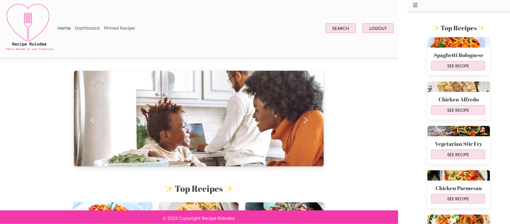

# 📇 RECIPE ROLODEX 📇

### [View Live Project Here](https://recipe-rolodex-d7c0cb19d5d1.herokuapp.com/ "RECIPE ROLODEX")<br />

| Technology Used    | Resource URL |
| --------  | ------- |
| NodeJS      | https://nodejs.org/en |
| Material Design for Bootstrap      | https://mdbootstrap.com/ |
| JavaScript | https://developer.mozilla.org/en-US/docs/Web/JavaScript |
| Git       | https://git-scm.com/ |
| GitHub     | https://github.com/ |
| VSCode    | https://code.visualstudio.com/ |
| Cloudinary    | https://cloudinary.com/ |
| Heroku    | https://www.heroku.com/ |
| GraphQL    | https://graphql.org/ |
| Apollo   | https://www.apollographql.com/ |
| React    | https://react.dev/ |
| Vite    | https://vitejs.dev/ |

## Table of Contents

* [Description](#description)
* [Installation](#installation)
* [Usage](#usage)
* [License](#license)
* [Authors](#authors)

## Description:
This interactive MERN stack single-page application, developed by [4 authors](#authors), allows users to see, search, upload, share, and pin the recipes. Users can sign up, sign in, and log out from the page. Some functionalities are limited to logged-in users. Such functionalities include  uploading, updating, snd pinning recipes, as well as creating or joining family groups. 

This application utilizes Cloudinary and Material Design for Bootstrap, in addition to GraphQL and Apollo. It was deployed using Heroku and utilizes authentication of users using Javascript Web Token.
### server.js code snippet
```
const express = require('express');
const { ApolloServer } = require('@apollo/server');
const { expressMiddleware } = require('@apollo/server/express4');
const path = require('path');
const { authMiddleware } = require('./utils/auth');

const { typeDefs, resolvers } = require('./schemas');
const db = require('./config/connection');

const PORT = process.env.PORT || 3001;
const app = express();
const server = new ApolloServer({
  typeDefs,
  resolvers,
});

const startApolloServer = async () => {
  await server.start();

  app.use(express.urlencoded({ extended: false }));
  app.use(express.json());

  // Serve up static assets
  app.use('/images', express.static(path.join(__dirname, '../client/images')));

  app.use('/graphql', expressMiddleware(server, {
    context: authMiddleware
  }));

  if (process.env.NODE_ENV === 'production') {
    app.use(express.static(path.join(__dirname, '../client/dist')));

    app.get('*', (req, res) => {
      res.sendFile(path.join(__dirname, '../client/dist/index.html'));
    });
  }

  db.once('open', () => {
    app.listen(PORT, () => {
      console.log(`API server running on port ${PORT}!`);
      console.log(`Use GraphQL at http://localhost:${PORT}/graphql`);
    });
  });
};

startApolloServer();

```

<br />


### How to use this app:

* Click on the deployed link above 'View Live Project Here'
    * See recipes in the home page
    * Navigate to search page from the nav and search by name of the recipe
    * Click on the individual recipe to see the details
    * Click on the family name to see all the recipes from the family

* Navigate to the "LOGIN" to sign up for more functionalities
    * Enter credentials
    * Navigate to the individual recipe and pin / unpin
    * Navigate to pinned recipe page to see all the recipes you pinned
    * Go to Dashboard page from the link in the nav bar
    * Join or create a family
    * Add your recipe to your family group
    * Click SEE RECIPES of the family card to see all the recipes added to the family group
    * Update or delete your recipe from the dashboard when you need to
    * Click LOGOUT in the nav bar to log out


### Lessons Learned

#### 1. Add a LazyQuery inside of the useEffect to run a query only in a certain condition
Author: Minami

We wanted to allow any users to see the details of the individual recipe, and when the user is already logged in, check if the user has already pinned that recipe or not to load the pin icon according to if the user has previously pinned that recipe or not. The query to get the userdata needs to run when the user is signed in. React doesn't allow the useQuery to be added inside of the if statment, such as 
```
if (loggedIn) {
    getUser({variables: { username: Auth.getProfile().authentigatedPerson.username}})
}
```
In order to achieve this without getting error returned from the server by trying to query the userdata when user is not signed in, I used `useLazyQuery` instead of `useQuery` and put the query inside of the `useEffect` I could conditionally run the query to check the userdata.
<br />


#### 2. initMDB & userEffect
Author: Nhi

Certain elements on the page will no respond intuitively using just normal javascript while working with react. Certain aspect of the code being nested within a `useEffect` will help the elements load on the page at once and not in individual chunks. 
```
  useEffect(() => {
    initMDB({ Ripple, Modal });
  });
```
That said, there are times where initMDB would be better used initiated outside of a `useEffect` state, it depends on the component being built. It depends on the specific use case and the behavior you want to achieve in your React component. If the initialization doesn't rely on any asynchronous or side-effect operations, and it doesn't need to be re-run in response to changes in props or state, then you might not need to use `useEffect `for that specific initialization. However, if there are dependencies involved or if the initialization should be tied to component lifecycle events, using `useEffect `is a common and appropriate pattern
<br />


#### 3. Establish Clear Communication Channels and Guidelines

Author: Anna

Building an interactive MERN stack SPA with a group requires effective communication among team members. Clear and consistent communication helps to avoid misunderstandings, reduces development errors, and ensures that everyone is on the same page throughout the project. Here are some key aspects that we considered which significantly contributed to our successful build:

- Regular Meetings: We scheduled daily meetings to discuss progress, challenges and goals. This helped maintain a shared understanding of the project's direction and allowed team members to raise concerns or suggest improvements. 

- Version Control: We implemented version control to manage and track changes to our codebase, with clearly defined branching strategies to avoid conflicts and ensure a smooth collaboration process. 

- Task Tracking: We utilized the projects tool within Github to track tasks, assign responsibilities, and monitor progress. This provided transparency into each team member's contributions and ensured that everyone was aware of their responsibilities. 

- Peer Code Reviews: We regularly reviewed each other's code to identify bugs, ensure code quality, and promote knowledge sharing among team members. 

- Addressing Challenges Openly: We felt comfortable addressing challenges openly. This included discussing roadblocks, asking for help, and sharing ideas for improvement. A collaborative and supportive atmosphere contributed to a more successful project for our team. 


#### 4. Authorized user content access
Author: Janet

Many areas throughout the application require user-authenticated dependency to pull back the appropriate data. 

One example for this is the recipes made by the logged in user in their dashboard.

This begins by validating the authenticated user in the dashboard page and then querying the user by their username.
<br />


Utilizing our useState from React, we set the recipes and then using our useEffect also from React, we are able to establish that if there is data, then to return the data related to the user.
<br />


Finally we map over all the recipes to return the recipes belonging to this user and display them in the dashboard with all of their necessary functionalities, otherwise we let the user know that they do not currently have any recipes yet.
<br />


## Installation

1. Create a new repository on GitHub, to store this project.
2. Clone the repository to your computer.
3. Copy files to your own repository.
4. Follow the steps for "How to" above
5. Make changes to the code.
6. Commit the changes to the local repo.
7. Push the changes to the remote repo.

## Usage

This is a full stack project to share recipes with your family or community. If you would like to update and use app follow the installation steps and curate it to your needs. If you would like to use this app, follow the steps under the description 'How to' above and click the link at the top of this page.

## License

MIT License
Copyright (c) 2023 Minami Mukai (Itsukaichi) / Anna Benedetti / Nhi Hoang / Janet Webster

<hr />

## Authors
### Minami Mukai (Itsukaichi)
Description
- [GitHub](https://github.com/mitsukaichi/)
- [LinkedIn](https://www.linkedin.com/in/minami-itsukaichi/)

### Anna Benedetti
Description
- [GitHub](https://github.com/abenedetti27/)
- [LinkedIn](https://www.linkedin.com/in/anna-rose-benedetti//)

### Nhi Hoang
Description
- [GitHub](https://) 
- [LinkedIn](https://) 

### Janet Webster
Full Stack MERN Software Engineer.

- [GitHub](https://github.com/TwixmixyJanet/)
- [LinkedIn](https://www.linkedin.com/in/twixmixy/)
- [Twitter](https://twitter.com/Twixmixy)
- [WakaTime](https://wakatime.com/@Twixmixy)
